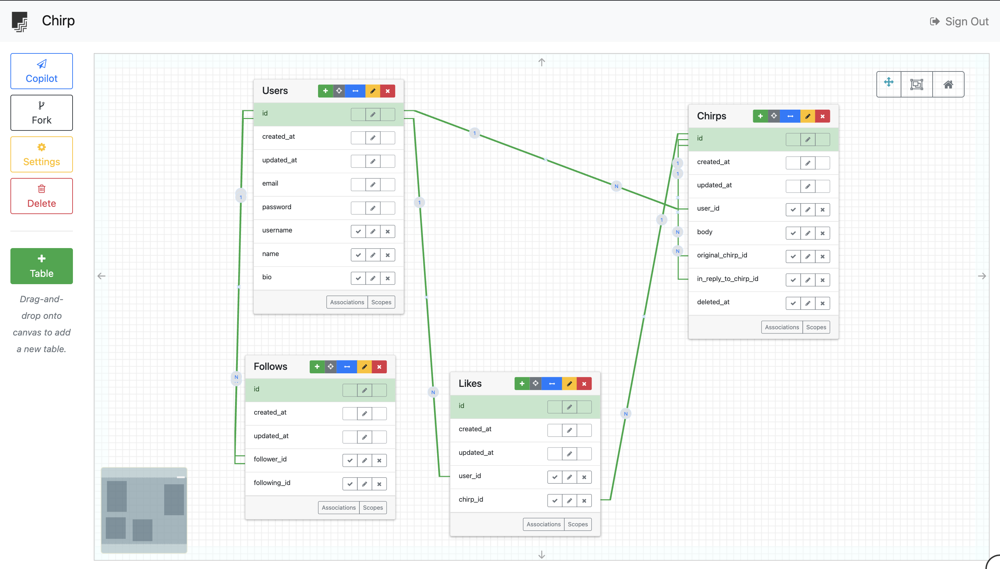

<!-- Project Name and 1-liner: A clear and concise summary of the project. -->
# Chirp Functional Specification

A Twitter-style microblogging app where users post short messages ("chirps"), follow others, and build personalized timelines.

<!-- Pain Point: What problem are you solving? -->
## Pain Point

People want a fast way to share short updates and discover content from people and topics they care about—without wading through long-form feeds or heavyweight publishing tools.

<!-- Target User Persona: Who is the primary user of this application? -->
## Target User Persona

- Casual social users who want a lightweight way to post and react
- Creators/experts who want reach and engagement
- Curious readers who want a personalized, real-time feed

## User Stories

- As a user, I want to create chirps (text) so I can share updates.
- As a user, I want to like a chirp so I can show appreciation.
- As a user, I want to follow/unfollow accounts so I can control my timeline.
- As a user, I want to see a reverse-chronological "Following" timeline and a "For You" timeline so I can browse content.
- As a user, I want to manage my profile (bio, avatar, username) so others can recognize me.

### Future

- As a user, I want to reply to a chirp so I can have conversations.
- As a user, I want to rechirp or quote a chirp so I can amplify or comment on it.
- As a user, I want to search by keyword/hashtag so I can discover topics.
- As a user, I want notifications for mentions, replies, follows, likes, and rechirps so I can keep up.
- As a user, I want to report or hide content so I can keep my experience healthy.

## Domain Model

### Entity Relationship Diagram (ERD)



### Users

```ruby
# id
# username (unique)
# name
# bio
# created_at
# updated_at

class User
  has_many :chirps
  has_many :follows_as_follower, class_name: "Follow", foreign_key: :follower_id
  has_many :follows_as_followed, class_name: "Follow", foreign_key: :following_id
  has_many :following, through: :follows_as_follower, source: :followed
  has_many :followers, through: :follows_as_followed, source: :follower

  has_many :likes
end
```

## Chirps

```ruby
# id
# user_id
# text, type (enum: original, reply, rechirp, quote)
# original_chirp_id (nullable)
# in_reply_to_chirp_id (nullable)
# likes_count
# rechirps_count
# replies_count
# quotes_count
# created_at
# updated_at
# deleted_at (nullable)

class Chirp
  belongs_to :user
  belongs_to :original_chirp, class_name: "Chirp", optional: true
  belongs_to :in_reply_to_chirp, class_name: "Chirp", optional: true

  has_many :media_attachments
  has_many :chirp_hashtags
  has_many :hashtags, through: :chirp_hashtags
  has_many :mentions
  has_many :liked_by, through: :likes, source: :user

  enum :type, { original: 0, reply: 1, rechirp: 2, quote: 3 }

# Validations
# - text presence if original/reply/quote; text blank for rechirp
# - original_chirp presence for rechirp/quote
# - length <= 280 (after stripping entities/urls if you choose)

end
```

## Follow

```ruby
# id
# follower_id
# following_id
# created_at

# (unique index on [follower_id, following_id])

class Follow
  belongs_to :follower, class_name: "User"
  belongs_to :followed, class_name: "User"
end
```

## Like

```ruby
# id, user_id, chirp_id, created_at (unique index on [user_id, chirp_id])

class Like
  belongs_to :user
  belongs_to :chirp
end
```

## Routes

```plaintext
POST /chirps → create (supports type, original_chirp_id, in_reply_to_chirp_id)
DELETE /chirps/:id → soft delete
POST /chirps/:id/like / DELETE /chirps/:id/like
POST /chirps/:id/rechirp (creates type=rechirp)
POST /chirps/:id/quote (body with text)

GET /timeline/following?since_id=…&max_id=…

GET /users/:handle (profile, counts, recent chirps)

POST /follows/:handle
DELETE /follows/:handle

GET /search?q=… (chirps + hashtags + users)
```
